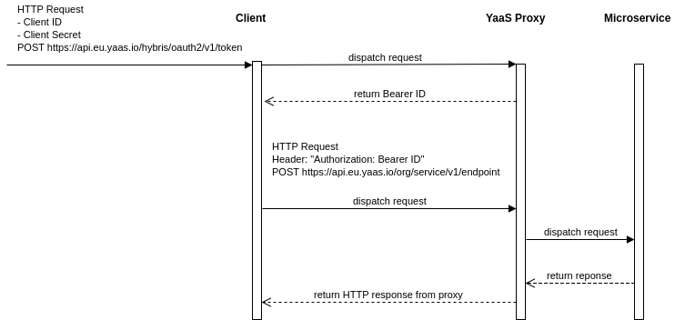

YaaS Java SDK
=============
[YaaS](https://yaas.io) (Hybris as a Service) SDK for Java and JVM


Overview
--------

This SDK allows to perform authorized requests to the microservices hidden behind YaaS proxy. 
Please note, this SDK is not an official SAP Hybris project and it does not cover all the features of YaaS. If you would like to learn more about YaaS, read an article on my blog about [basic usage of YaaS as a proxy for the microservice](http://blog.wittchen.biz.pl/basic-usage-of-yaas-as-a-proxy-for-the-microservice/). Moreover, you can read an article about [Introducing YaaS Java SDK](http://blog.wittchen.biz.pl/introducing-yaas-java-sdk/).

Tech stack of the SDK: Java 8, [Gradle](https://gradle.org/), [OkHttp3](http://square.github.io/okhttp/), [RxJava2](https://github.com/ReactiveX/RxJava) with [Reactive Streams](http://www.reactive-streams.org/), [Gson](https://github.com/google/gson)

Contents
--------
- [Quick start](#quick-start)
- [Client API](#client-api)
- [Authorization procedure in YaaS](#authorization-procedure-in-yaas)
- [Building the SDK](#building-the-sdk)
- [Building and running example](#building-and-running-example)
- [Tests](#tests)
- [Static Code Analysis](#static-code-analysis)
- [Code style](#code-style)
- [References](#references)
- [License](#license)

Quick start
-----------

Exemplary usage of this SDK is as follows:

```java
YaaSProject project = new YaaSProject.Builder()
    .withClientId("YOUR_CLIENT_ID")
    .withClientSecret("YOUR_CLIENT_SECRET")
    .withOrganization("YOUR_ORGANIZATION")
    .withService("YOUR_SERVICE")
    .withVersion("v1")
    .withZone(Zone.EU)
    .build();

Client client = new YaaS(project);

client.get("path/to/your/endpoint")
    .subscribeOn(Schedulers.newThread())
    .blockingSubscribe(response -> System.out.println(response.body().string()));
```

Client API
----------

`Client` interface supports basic HTTP methods like: `GET`, `POST`, `PUT` & `DELETE`.

```java
Flowable<Response> get(final String path);
Flowable<Response> post(final String path, final RequestBody body);
Flowable<Response> put(final String path, final RequestBody body);
Flowable<Response> delete(final String path, final RequestBody body);
Flowable<Response> delete(final String path);
```

Authorization procedure in YaaS
-------------------------------

Authorization procedure of the microservice endpoint is presented in the scheme below.

SDK follows this procedure in each call to the endpoint of the microservice.



Building the SDK
----------------

In order to build `*.jar` file with SDK, call the following command:

```
./gradlew jar
```

SDK compiled into `*.jar` file will be available in `sdk/build/libs/` directory.

Building and running example
----------------------------

In order to build and run sample app located in the `example` directory, call the following command:

```
./gradlew clean build run 
```

Tests
-----

To run tests, call the following command:

```
./gradlew test
```

Static Code Analysis
--------------------

To run Static Code Analysis with CheckStyle, PMD and FindBugs, call the following command:

```
./gradlew check
```

Code style
----------

Code style used in the project is called `Square` from Java Code Styles repository by Square available at: https://github.com/square/java-code-styles.

References
----------
- [Basic usage of YaaS as a proxy for the microservice](http://blog.wittchen.biz.pl/basic-usage-of-yaas-as-a-proxy-for-the-microservice/)
- [Introducing YaaS Java SDK](http://blog.wittchen.biz.pl/introducing-yaas-java-sdk/)
- [SAP Hybris](http://hybris.com/en/)
- [YaaS](https://yaas.io)

License
-------

    Copyright 2017 Piotr Wittchen

    Licensed under the Apache License, Version 2.0 (the "License");
    you may not use this file except in compliance with the License.
    You may obtain a copy of the License at

       http://www.apache.org/licenses/LICENSE-2.0

    Unless required by applicable law or agreed to in writing, software
    distributed under the License is distributed on an "AS IS" BASIS,
    WITHOUT WARRANTIES OR CONDITIONS OF ANY KIND, either express or implied.
    See the License for the specific language governing permissions and
    limitations under the License.
